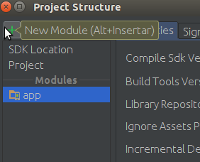

# Arcadio Library for Android
Arcadio Library Android es una librería de comunicación con COSME escrita en Java. Esta librería es una adaptacion de la librería estandar Arcadio haciendo que pueda funcionar como un servicio background en Android facilitando su utilización en esta plataforma. Para su funcionamiento es necesario tener instalada la aplicación MiniBlas.
##	Importar la librería en Android Studio
Esta librería se distribuye mediante un fichero con extensión .aar o .jar, para la utilización de esta librería en los proyectos Android con el entorno de desarrollo Android Studio se debe de realizar los siguientes pasos:
* En primer lugar, se debe de añadir al proyecto la librería, para ello seleccionamos en el menu File la opcion Project Structure
  ![Config RT] (screenshots/1.png)

A continuacion, hacemos clic en el boton con el icono de un más, y seleccionamos Import .jar or  .aar library e introducimos la ruta donde se encuentra el fichero libreriaArcadio.aar 
  ![Config RT] (screenshots/3.png)

Seleccionamos la opción app y el la pestaña Dependencies, hacemos clic en el botón con el icono del más, a continuacion seleccionamos Module dependency y seleccionamos la librería arcadioAndroidLibrary. Una vez realizados estos paso ya tendriamos la librería añadida en nuestro proyecto.

 ![Config RT] (screenshots/4.png)

